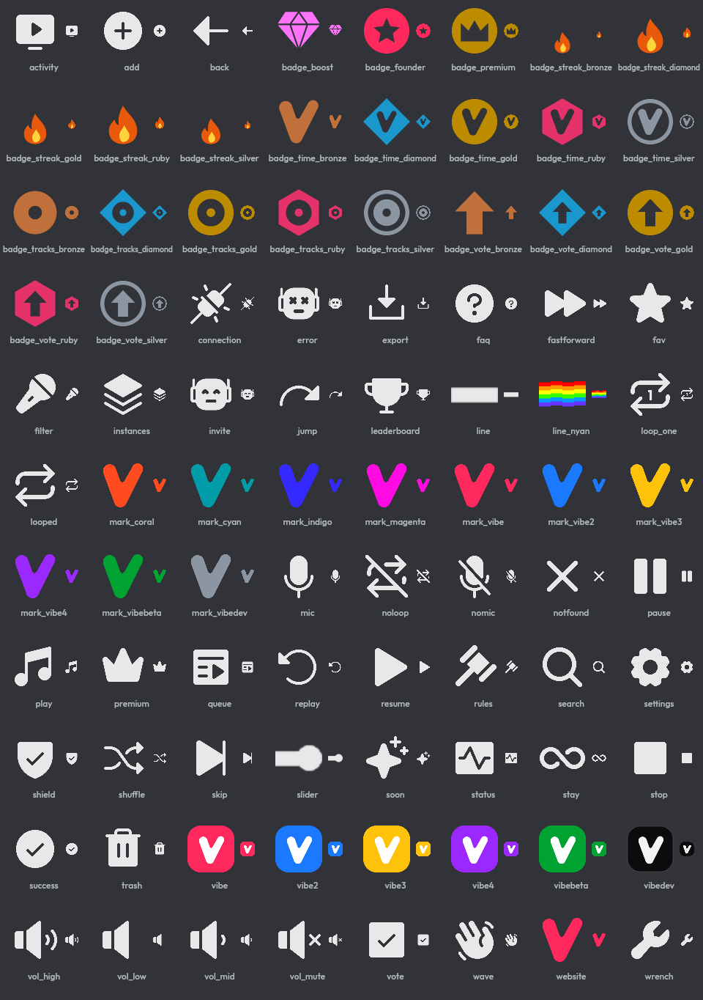
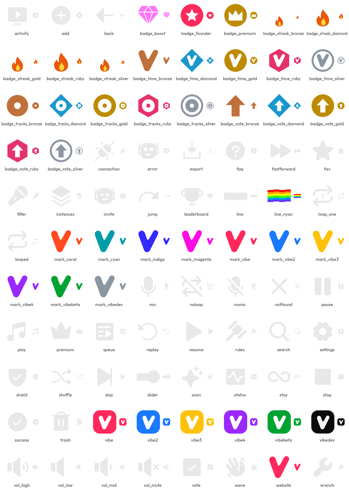

# Vibe: brand

The logos, emoji, badges, banners and fonts of [Vibe](https://playvibe.gg), a Discord music bot.
This repository exists so you can look at them, suggest better ones, and open a pull request with a
redesign.

## What is here

```
brand/vectors/      the V and the wordmark, as SVG (the source of everything below)
brand/logos/        the bots' avatars: the V on each bot's colour
brand/banners/      the bots' profile banners
brand/server/       the support server's icon, banner and invite splash
brand/activity/     one folder per bot: the Activity's cover, background and invite images (and its preview, where there is one)
brand/listing/      the splash for bot listings
brand/premium/      the premium tiers' store images and benefit images
brand/press/        screenshots and renders used on the website and in listings
emojis/             application emoji, badges and the V marks (see below)
viber-emojis/       the four status dots of the uptime bot, and its avatar
fonts/              Outfit and Sacramento, with their licences
gallery/            contact sheets of every emoji, dark and light
LICENSES/           licences of the third-party parts
```

The rules for using them are on one page: [BRAND.md](BRAND.md).

Vibe's site is [playvibe.gg](https://playvibe.gg); the code for it is in
[playingvibe/website](https://github.com/playingvibe/website).

## The emoji

Every emoji at 64 px and at the 20 px it is read at, on Discord's dark and light themes:




The glyphs are near-white (`#E8E8E8`) on transparency, chosen to read on dark. They are faint on the
light theme, as the second sheet shows. A proposal that fixes that for the **whole** set is very
welcome; a single icon that breaks from the set is not. See [CONTRIBUTING.md](CONTRIBUTING.md) for
what a good proposal contains.

## Proposing a change

Open an issue with the *Design proposal* template, or send a pull request. The checks and the terms
are in [CONTRIBUTING.md](CONTRIBUTING.md). A change that is accepted is copied into Vibe, regenerated
where other images are derived from it, and uploaded to Discord, which is why a design has to work at
emoji size before it counts.

## Licence and the Vibe name

- The artwork in this repository is licensed under
  [Creative Commons Attribution-NonCommercial 4.0](LICENSE) (CC BY-NC 4.0): you may share and adapt
  it with credit, for non-commercial purposes.
- **The name "Vibe" and the V logo are trademarks and are not licensed for use as the identity of
  another bot, product or service.** [TRADEMARKS.md](TRADEMARKS.md) says what you may do.
- Third-party parts keep their own licences: [Phosphor Icons](LICENSES/Phosphor-MIT.txt) (MIT) behind
  a few emoji, and the fonts in [`fonts/`](fonts/) (SIL Open Font License 1.1).
- What is not here is not offered: third-party logos, other people's characters and screenshots of
  real accounts are left out on purpose.

## Security and conduct

[SECURITY.md](SECURITY.md) · [CODE_OF_CONDUCT.md](CODE_OF_CONDUCT.md)
